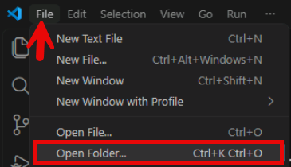
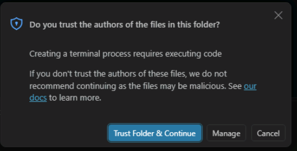
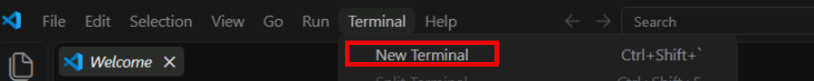

# Exercise 1: Open the application workspace

Open the Caldova Inventory application workspace in Visual Studio Code on APP01 and verify that the integrated PowerShell terminal is working from the correct project directory.

1. Make sure that your development container (APP01) from Exercise 0 is running and open in Visual Studio Code. If the codespace or container restarted, Visual Studio Code reopens the repository folder; complete the following steps to open the workspace folder again.

1. Select **File**, then select **Open Folder**. In GitHub Codespaces in a browser, the **File** menu is under the menu button (**☰**).

    

1. Enter `/home/vscode/LabFiles/CaldovaInventory`, and then select **OK**. Visual Studio Code reloads the window with the folder open.

    > **Note:** If Visual Studio Code asks whether you trust the authors of the files, review the folder location and trust the workspace.
    >
    > 

1. Select **Terminal**, then select **New Terminal**.

    

1. Confirm that the terminal prompt shows **/home/vscode/LabFiles/CaldovaInventory**.

---

[← Exercise 0: Environment setup](../00-environment-setup/index.md) · [Lab index](../../Index.md) · [Exercise 2: Sign in to GitHub Copilot →](../02-sign-in-to-github-copilot/index.md)
