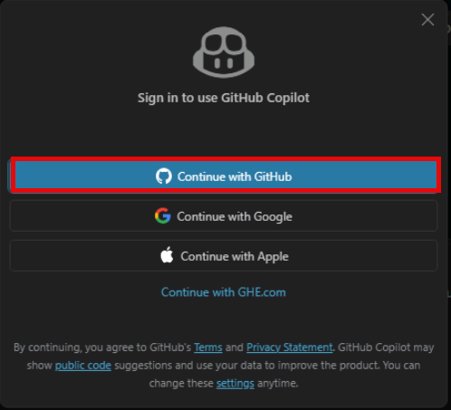

# Exercise 2: Sign in to GitHub Copilot

Sign in to GitHub with your own account, connect Visual Studio Code to GitHub, and verify that GitHub Copilot is available for the lab.

> **Note:** In GitHub Codespaces, Visual Studio Code is usually already signed in with the GitHub account that created the codespace. If the **Accounts** menu in the lower-left corner already shows your GitHub account, skip to the last step.

1. Select **Sign in**.

    

1. Select **Continue with GitHub**.

    

1. A new browser window will open. Sign in to GitHub if prompted, and then select **Continue to authorize Visual Studio Code**.

1. A new window will open, select **Authorize Visual-Studio-Code**.

    

    > **Note:** For any **Open** messages, select **Open**.

1. Confirm the GitHub account appears as signed in from the Visual Studio Code Accounts menu by selecting the account tab located at the lower left of the window.

---

[← Exercise 1: Open the application workspace](../01-open-the-application-workspace/index.md) · [Lab index](../../Index.md) · [Exercise 3: Establish the application baseline →](../03-establish-the-application-baseline/index.md)
