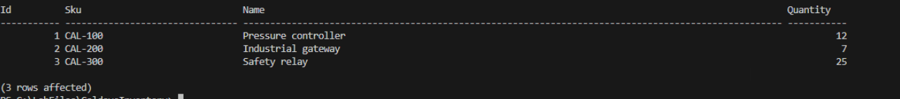
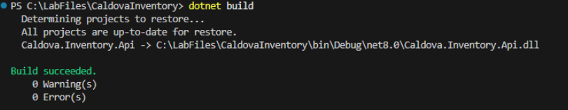
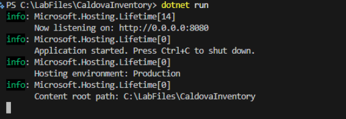
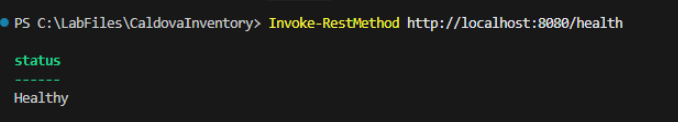
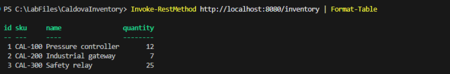

# Exercise 3: Establish the application baseline

Verify the prepared inventory data on SQL01, build and run the starter .NET application, and validate the local health and inventory endpoints to establish a known working baseline.

## Verify the source data

1. Query the source records by entering the following command in the terminal.

    ```powershell
    sqlcmd -S SQL01,1433 -C -U sa -P "Passw0rd!" -d CaldovaInventory -Q "SELECT Id, Sku, Name, Quantity FROM dbo.InventoryItems ORDER BY Sku;"
    ```

1. Confirm that only **CAL-100**, **CAL-200**, and **CAL-300** are returned.

    

## Build the starter application

1. Remove any connection-string environment variable.

    ```powershell
    Remove-Item Env:ConnectionStrings__Inventory -ErrorAction SilentlyContinue
    ```

1. Restore the project dependencies.

    ```powershell
    dotnet restore
    ```

1. Build the application.

    ```powershell
    dotnet build
    ```

1. Confirm that the output includes **Build succeeded** and no errors are reported.

    

## Verify current behavior

1. Start the application.

    ```powershell
    dotnet run
    ```

1. Wait until the terminal reports that the application is listening on port **8080**.

    

1. Leave the application terminal open.

1. Select **Terminal**, then select **New Terminal** to open a second integrated terminal.

1. Test the health endpoint.

    ```powershell
    Invoke-RestMethod http://localhost:8080/health
    ```

1. Confirm that the **Status** is **Healthy**.

    

    > **Note:** The health endpoint confirms that the web application is running. It doesn't, by itself, confirm a working database connection.

1. Test the inventory endpoint.

    ```powershell
    Invoke-RestMethod http://localhost:8080/inventory | Format-Table
    ```

1. Confirm that the response contains **CAL-100**, **CAL-200**, and **CAL-300**.

    

    > **Note:** The successful inventory response confirms that:
    >
    > - APP01 can connect to SQL01.
    > - SQL Server Authentication works.
    > - The application can open the **CaldovaInventory** database.
    > - The application can read from **dbo.InventoryItems**.

1. Return to the application terminal.

1. Select **Ctrl+C** to stop the application and confirm that the application stops.

    

---

[← Exercise 2: Sign in to GitHub Copilot](../02-sign-in-to-github-copilot/index.md) · [Lab index](../../Index.md) · [Exercise 4: Document the application baseline →](../04-document-the-application-baseline/index.md)
