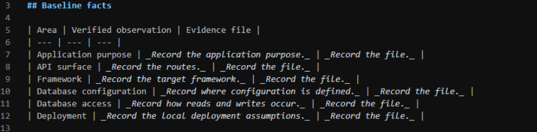
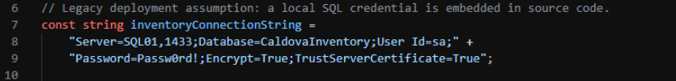
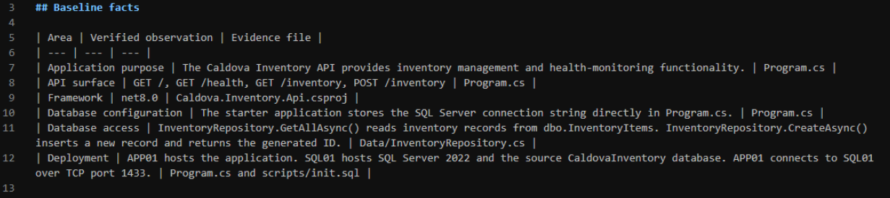

# Exercise 4: Document the application baseline

Review the application, project, repository, and SQL initialization files to document the application's purpose, API surface, framework, database configuration, database access pattern, and deployment architecture.

1. Open **evidence/assessment-notes.md** and complete the six existing rows in the **Baseline facts** table.

    

## Complete the Application purpose row

1. Open **Program.cs** and note that the application = "**Caldova Inventory API**".

1. In the **Application purpose** row of **assessment-notes.md**, enter:

    ```text
    The Caldova Inventory API provides inventory management and health-monitoring functionality.
    ```

1. Enter `Program.cs` as the evidence file.

## Complete the API surface row

1. Locate the **app.MapGet** and **app.MapPost** calls in **Program.cs**.

1. See that the routes are: **GET /**, **GET /health**, **GET /inventory**, and **POST /inventory**.

1. In the **API surface** row of **assessment-notes.md**, enter:

    ```text
    GET /, GET /health, GET /inventory, POST /inventory
    ```

1. Enter `Program.cs` as the evidence file.

## Complete the Framework row

1. Open **Caldova.Inventory.Api.csproj**.

1. Locate the **TargetFramework** element.

1. Copy the exact value between the opening and closing tags.

1. Enter the value in the **Framework** row.

1. Enter `Caldova.Inventory.Api.csproj` as the evidence file.

    > **Note:** The expected value is `net8.0`, but verify the project file instead of copying this example.

## Complete the database configuration row

1. Open **Program.cs**.

1. Locate: **const string inventoryConnectionString**

1. Confirm that the starter connection string and credential are defined directly in **Program.cs**.

    

1. In the **Database configuration** row of **assessment-notes.md**, enter:

    ```text
    The starter application stores the SQL Server connection string directly in Program.cs.
    ```

1. Enter `Program.cs` as the evidence file.

## Complete the database access row

1. Open **Data/InventoryRepository.cs**.

1. Locate **GetAllAsync()** and its **SELECT** statement.

1. Locate **CreateAsync()** and its **INSERT** statement.

1. In the **Database access** row of **assessment-notes.md**, enter:

    ```text
    InventoryRepository.GetAllAsync() reads inventory records from dbo.InventoryItems. InventoryRepository.CreateAsync() inserts a new record and returns the generated ID.
    ```

1. Enter `Data/InventoryRepository.cs` as the evidence file.

## Complete the Deployment row

1. Locate **Server=SQL01,1433** in **Program.cs**.

1. Open **scripts/init.sql**.

1. Confirm that the script creates or resets **CaldovaInventory** and **dbo.InventoryItems**.

1. In the **Deployment** row, enter:

    ```text
    APP01 hosts the application. SQL01 hosts SQL Server 2022 and the source CaldovaInventory database. APP01 connects to SQL01 over TCP port 1433.
    ```

1. Enter `Program.cs and scripts/init.sql` as the evidence files.

1. Save **evidence/assessment-notes.md**.

    

---

[← Exercise 3: Establish the application baseline](../03-establish-the-application-baseline/index.md) · [Lab index](../../Index.md) · [Exercise 5: Assess the workload with GitHub Copilot →](../05-assess-the-workload-with-github-copilot/index.md)
