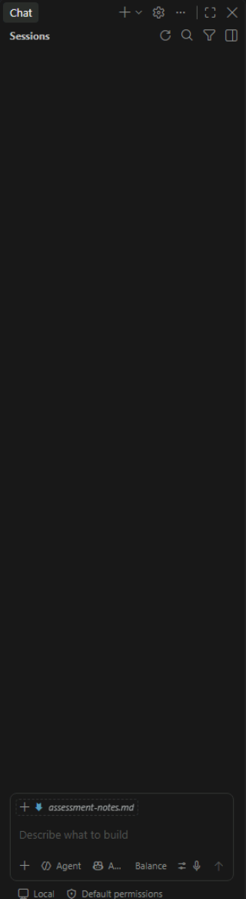
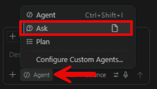

# Exercise 5: Assess the workload with GitHub Copilot

Use GitHub Copilot Ask mode to assess the .NET and SQL Server workload, verify Copilot's findings against source files and external support information, and record the top modernization priorities and supporting evidence.

## Summarize the workload

1. Go to the **Chat** area in Visual Studio Code.

    

1. Select **Ask** from the mode picker.

    

1. Enter:

    ```text
    Analyze this workspace as a .NET and SQL Server modernization architect.

    Summarize the application architecture, request flow, framework and package
    dependencies, SQL Server touchpoints, configuration sources, application image
    readiness, deployment assumptions, and runtime constraints.

    Account for the current lab architecture:
    - The application runs on APP01.
    - SQL Server 2022 runs on SQL01.
    - APP01 connects to SQL01 over TCP port 1433.
    - The source database is CaldovaInventory.
    - The supplied Dockerfile is the application image definition for the Azure
      Container Registry cloud build.

    Cite the file that supports each claim.
    Do not edit files.
    Mark anything you cannot verify as an assumption.
    ```

1. Review the information cited by Copilot.

## Review the .NET support policy

1. Open **Caldova.Inventory.Api.csproj** and verify its target framework.

1. Review the [.NET support policy](https://dotnet.microsoft.com/platform/support/policy/dotnet-core).

1. Locate the matching release, release type, and end-of-support date.

1. Open **evidence/assessment-notes.md**.

1. Locate the **Prioritized modernization findings** table.

1. Record the framework lifecycle as a compatibility finding.

## Prioritize modernization findings

1. Enter into the chat:

    ```text
    Based on the verified workspace evidence and .NET support-policy information,
    identify modernization findings for the application and database.

    Group findings as security, compatibility, reliability, operations, or
    maintainability. For each finding, provide evidence, risk, effort, customer
    value, and a safe next action. Rank the top three blockers.

    Account for APP01 and SQL01. Do not edit files. Mark unsupported claims as
    assumptions.
    ```

    > **Note:** Make sure to select **Allow** if any messages are received to allow in the chat.

1. Verify the finding against the cited file.

1. Confirm that the findings consider:

    - Framework lifecycle
    - Credential and secret management
    - Database compatibility
    - Migration validation
    - Network connectivity
    - Azure identity
    - The two-VM operational model

1. Complete the top three rows in **evidence/assessment-notes.md**.

## Example Prioritized modernization findings table:

| Rank | Category | Finding and evidence | Risk | Effort | Customer value | Next action |
| --- | --- | --- | --- | --- | --- | --- |
| 1 | `Compatibility` | `Application targets .NET 8. .NET 8 reaches end of support on November 10, 2026. Evidence: Caldova.Inventory.Api.csproj and .NET Support Policy.`| `The application won't receive support after the verified date.` | `Medium` | `Maintains vendor support and servicing.` | `Test an upgrade to a currently supported release.` |
| 2 | `Security` | `Program.cs contains the SQL connection string and synthetic credential.` | `Source-controlled credentials can be exposed and are difficult to rotate.` | `Small` | `Separates secrets from code.` | `Read ConnectionStrings:Inventory from configuration.` |
| 3 | `Compatibility` | `The schema and data haven't been validated on Azure SQL Database.` | `Compatibility or copy errors could block migration.` | `Medium` | `Reduces migration risk.` | `Initialize Azure SQL, migrate the rows, and reconcile counts.` |

1. Save `evidence/assessment-notes.md`.

---

[← Exercise 4: Document the application baseline](../04-document-the-application-baseline/index.md) · [Lab index](../../Index.md) · [Exercise 6: Externalize the database configuration →](../06-externalize-the-database-configuration/index.md)
