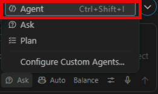
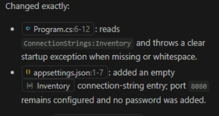

# Exercise 6: Externalize the database configuration

Use GitHub Copilot Agent mode to remove the hardcoded SQL Server connection string from the application, move database configuration to ASP.NET Core configuration, and validate that the bounded change meets the defined acceptance criteria.

## Generate the bounded change

1. Select **Agent** in Copilot Chat.

    

1. Enter:

    ```text
    Make one bounded configuration change in this ASP.NET Core application.

    Acceptance criteria:
    - Remove the hard-coded SQL connection string from Program.cs.
    - Read ConnectionStrings:Inventory through ASP.NET Core configuration.
    - Fail at startup with a clear message when the value is missing, empty, or
      whitespace.
    - Add an empty Inventory entry to appsettings.json.
    - Keep the application URL configured for port 8080.
    - Do not place a password in appsettings.json.
    - Keep InventoryRepository and every API route unchanged.
    - Do not add packages or redesign data access.
    - Do not change the Dockerfile.
    - Build the project and summarize the exact files changed.
    - Ask before making changes outside Program.cs and appsettings.json.
    ```

1. Select **Allow** for any confirmations in the chat.

    

1. Review the proposed changes.

    

1. Confirm that only **Program.cs** and **appsettings.json** changed.

1. Select **Keep** in the chat.

    

    > **Note:** If the result doesn't meet every acceptance criterion, apply the supplied reference files.
    >
    > ```powershell
    > Copy-Item solution/Program.cs Program.cs -Force
    > Copy-Item solution/appsettings.json appsettings.json -Force
    > dotnet build
    > ```

## Inspect Program.cs

1. Confirm that **Program.cs** uses **builder.Configuration.GetConnectionString("Inventory")**.

1. Confirm that startup rejects a **missing**, **empty**, or **whitespace-only connection string**.

1. Confirm that **Program.cs** doesn't contain:

    - The SQL01 IP address.
    - The SQL login password.
    - A hardcoded database connection.
    - A source-controlled database credential.

1. Confirm that the configured connection string is passed to **InventoryRepository**.

1. Confirm that the API routes remain unchanged.

## Inspect appsettings.json

1. Confirm that **appsettings.json** doesn't contain a database password.

1. Confirm that **ConnectionStrings:Inventory** is empty.

1. Confirm that **Urls** is: **http://0.0.0.0:8080**

## Inspect InventoryRepository.cs

1. Confirm that the repository receives the connection string through its constructor.

1. Confirm that the repository contains no hardcoded SQL Server address or password.

1. Confirm that the repository reads from and writes to **dbo.InventoryItems**.

## Inspect InventoryItem.cs

1. Confirm that the response model and creation model contain the expected ID, SKU, name, and quantity properties.

---

[← Exercise 5: Assess the workload with GitHub Copilot](../05-assess-the-workload-with-github-copilot/index.md) · [Lab index](../../Index.md) · [Exercise 7: Validate the updated application →](../07-validate-the-updated-application/index.md)
