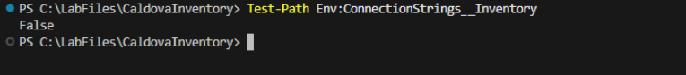
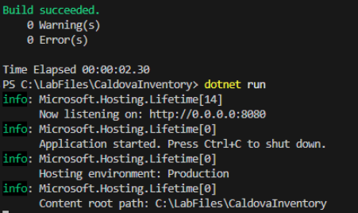
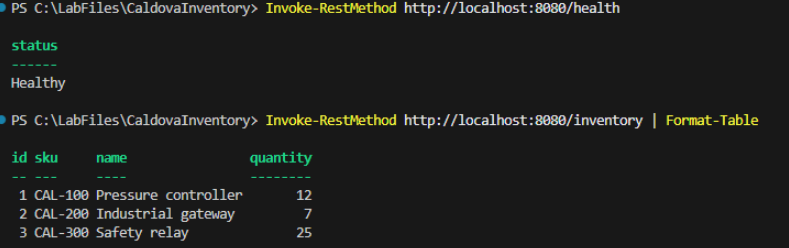
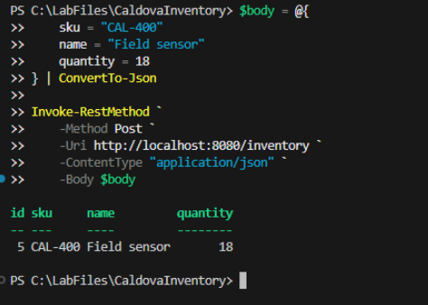
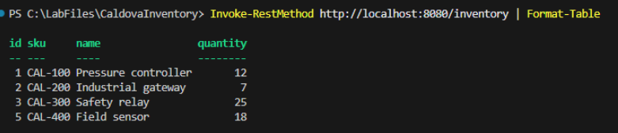

# Exercise 7: Validate the updated application

Verify the application's configuration behavior, provide the SQL Server connection string through an environment variable, rebuild the application, and validate local health, inventory read, and inventory write operations.

1. In the terminal, remove the connection string.

    ```powershell
    Remove-Item Env:ConnectionStrings__Inventory -ErrorAction SilentlyContinue
    ```

1. Verify that the variable is removed by running the script and that a **False** statement is returned.

    ```powershell
    Test-Path Env:ConnectionStrings__Inventory
    ```

    

## Validate the updated local application

1. Set the SQL01 connection string in the same terminal that will run the application.

    ```powershell
    $env:ConnectionStrings__Inventory = "Server=SQL01,1433;Database=CaldovaInventory;User Id=sa;Password=Passw0rd!;Encrypt=True;TrustServerCertificate=True"
    ```

1. Verify that the variable exists by running the following script and a **True** statement is returned.

    ```powershell
    Test-Path Env:ConnectionStrings__Inventory
    ```

    

1. Build and run the application.

    ```powershell
    dotnet build
    ```

    ```powershell
    dotnet run
    ```

1. Confirm the build succeeded and the application has started and is listening.

    

1. Open a second terminal by selecting **Terminal** and then **New Terminal**.

1. Test the health and read paths.

    ```powershell
    Invoke-RestMethod http://localhost:8080/health
    ```

    ```powershell
    Invoke-RestMethod http://localhost:8080/inventory | Format-Table
    ```

1. Confirm that health returns **Healthy** and inventory returns the three source records.

    

1. Create a new inventory record by running the following script.

    ```powershell
    $body = @{
        sku = "CAL-400"
        name = "Field sensor"
        quantity = 18
    } | ConvertTo-Json

    Invoke-RestMethod `
        -Method Post `
        -Uri http://localhost:8080/inventory `
        -ContentType "application/json" `
        -Body $body
    ```

1. Confirm that the response includes **CAL-400** and an assigned numeric ID.

    

1. Verify that the inventory endpoint returns four rows.

    ```powershell
    Invoke-RestMethod http://localhost:8080/inventory | Format-Table
    ```

    

1. Return to the application terminal and select **Ctrl+C**.

---

[← Exercise 6: Externalize the database configuration](../06-externalize-the-database-configuration/index.md) · [Lab index](../../Index.md) · [Exercise 8: Validate the change with GitHub Copilot CLI →](../08-validate-the-change-with-github-copilot-cli/index.md)
