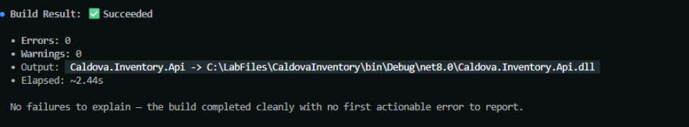

# Exercise 8: Validate the change with GitHub Copilot CLI

Use GitHub Copilot CLI as an independent validation surface to review the configuration changes, build the application, compare the results with the Visual Studio Code review, and record verified evidence.

## Start the CLI session

1. Clear the connection string before starting Copilot CLI.

    ```powershell
    Remove-Item Env:ConnectionStrings__Inventory -ErrorAction SilentlyContinue
    ```

    > **Note:** Clearing the environment variable prevents the synthetic SQL credential from being inherited by the GitHub Copilot CLI process.

1. Start GitHub Copilot CLI.

    ```powershell
    copilot
    ```

1. When prompted to authenticate, enter the following command. If Copilot CLI doesn't prompt you, it's already signed in; skip to **Review the configuration**.

    ```text
    /login
    ```

1. Select **GitHub.com**.

1. If Copilot CLI asks how you want to sign in, select **Sign in with a device code**.

1. Copilot CLI displays a one-time code. Open `https://github.com/login/device` in your browser, enter the code, and sign in with your GitHub account if prompted.

1. Review the requested permissions, and then select **Authorize** in the browser window.

1. Return to Visual Studio Code.

## Review the configuration

1. Copy the following text into Copilot:

    ```text
    Review @Program.cs, @appsettings.json, and @Dockerfile against these criteria:

    - The Inventory connection string comes from ASP.NET Core configuration.
    - Startup rejects a missing, empty, or whitespace value.
    - appsettings.json contains no credential.
    - The application listens on port 8080.
    - Repositories, routes, and packages remain unchanged.

    Do not edit files.
    Cite the file and relevant code for every conclusion.
    Mark unsupported claims as assumptions.
    ```
    > **Note:** It may take a minute for the sign in process to complete.

1. Review the response.

## Build with GitHub Copilot CLI

1. Enter:

    ```text
    Run dotnet build without changing any files.

    Report whether the build succeeds, including the error and warning counts.

    If the build fails, explain the first actionable error, but do not fix it.
    ```

1. Approve the **dotnet build** command.

1. Confirm that the build succeeds.

    

1. Record the CLI review, build result, warning count, error count, and any difference from the Visual Studio Code review in **evidence/assessment-notes.md**.

## Complete the Bounded change evidence table

1. Open **evidence/assessment-notes.md**.

1. Complete each row using actual observed results.

## Example completed Bounded change evidence table

| Check | Result | Evidence |
| --- | --- | --- |
| Credential removed from C# source | `Pass` | `Program.cs reads ConnectionStrings:Inventory and contains no SQL password.` |
| Updated application builds | `Pass` | `dotnet build completed with 0 errors.` |
| Copilot CLI review matches acceptance criteria | `Pass` | Record the actual independent CLI result. |
| Copilot CLI build succeeds | `Pass` |Record the actual independent CLI result. |
| Health endpoint responds | `Pass` | `GET /health returned Healthy on port 8080.` |
| Inventory read succeeds | `Pass` | `GET /inventory returned the source records.` |
| Inventory write succeeds |`Pass` | `POST /inventory created CAL-400; record the assigned ID.` |

1. Save **evidence/assessment-notes.md**.

1. Enter the following prompt to exit Copilot:

    ```text
    /exit
    ```

---

[← Exercise 7: Validate the updated application](../07-validate-the-updated-application/index.md) · [Lab index](../../Index.md) · [Exercise 9: Migrate the data to Azure SQL Database →](../09-migrate-the-data-to-azure-sql-database/index.md)
