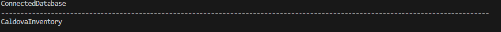
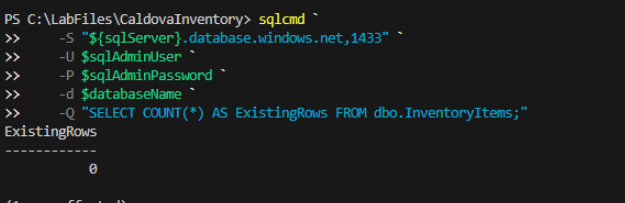
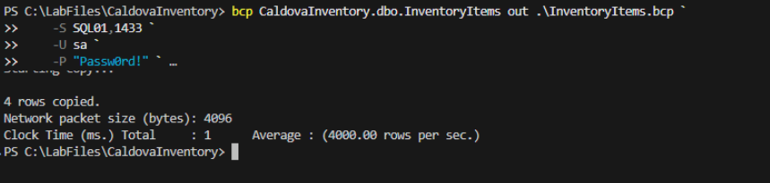
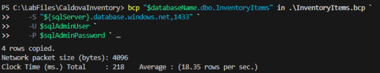
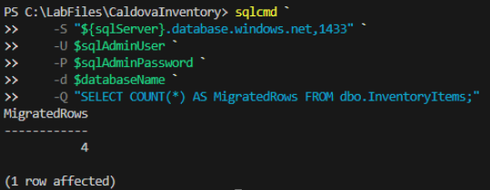

# Exercise 9: Migrate the data to Azure SQL Database

Sign in to Azure, discover the predeployed resources in your lab resource group, initialize the Azure SQL Database, migrate the four inventory records from SQL01, and reconcile the migrated data.

## Sign in and define resources

1. Sign in to Azure.

    ```powershell
    az login --use-device-code
    ```

1. Azure CLI displays a code and the address `https://microsoft.com/devicelogin`. Open the address in a browser, enter the code, and then select **Next**.

1. Sign in with an account that has access to the Azure subscription that you used in Exercise 0.

1. Return to Visual Studio Code.

1. When prompted in the terminal for the subscription, enter the number of the subscription that you used in Exercise 0, and then select **Enter**.

1. Discover the predeployed resource names and location.

    ```powershell
    $resourceGroup = Read-Host "Enter the name of the lab resource group that you created in Exercise 0"

    $sqlServer = az resource list `
    --resource-group $resourceGroup `
    --resource-type "Microsoft.Sql/servers" `
    --query "[0].name" `
    --output tsv

    $databaseName = "CaldovaInventory"

    $registryName = az resource list `
    --resource-group $resourceGroup `
    --resource-type "Microsoft.ContainerRegistry/registries" `
    --query "[0].name" `
    --output tsv

    $environmentName = az resource list `
    --resource-group $resourceGroup `
    --resource-type "Microsoft.App/managedEnvironments" `
    --query "[0].name" `
    --output tsv

    $containerAppName = az resource list `
    --resource-group $resourceGroup `
    --resource-type "Microsoft.App/containerApps" `
    --query "[0].name" `
    --output tsv

    $identityName = az resource list `
    --resource-group $resourceGroup `
    --resource-type "Microsoft.ManagedIdentity/userAssignedIdentities" `
    --query "[0].name" `
    --output tsv

    $location = az group show `
    --name $resourceGroup `
    --query location `
    --output tsv
    ```

    ```powershell
    $imageName = "caldova-inventory"
    ```

1. Display the discovered values.

    ```powershell
    [pscustomobject]@{
    ResourceGroup            = $resourceGroup
    Location                 = $location
    SqlServer                = $sqlServer
    Database                 = $databaseName
    Registry                 = $registryName
    ContainerAppsEnvironment = $environmentName
    ContainerApp             = $containerAppName
    ManagedIdentity          = $identityName
    Image                    = $imageName
    } | Format-List
    ```

    > **Note:** The Azure resources are already deployed. Continue with database initialization, data migration, application image upload, and Container App configuration.

## Define the Azure SQL administrator credentials

1. Set the Azure SQL administrator user name by using the value shown in the deployment output in Exercise 0.

    ```powershell
    $sqlAdminUser = Read-Host "Enter the Azure SQL administrator user name"
    ```
1. Enter the username as:

    ```text
    caldovaadmin
    ```

1. Enter the Azure SQL administrator password as a secure value.

    ```powershell
    $sqlAdminSecurePassword = Read-Host "Enter the Azure SQL administrator password" -AsSecureString
    ```

1. When prompted, enter the Azure SQL administrator password that you chose when you ran the setup script in Exercise 0.

1. Run the following script:

    ```powershell
    $sqlAdminPassword = [System.Net.NetworkCredential]::new("", $sqlAdminSecurePassword).Password
    ```

## Verify Azure SQL connectivity

1. Test the connection to the predeployed Azure SQL Database.

    ```powershell
    sqlcmd `
        -S "${sqlServer}.database.windows.net,1433" `
        -U $sqlAdminUser `
        -P $sqlAdminPassword `
        -d $databaseName `
        -Q "SELECT DB_NAME() AS ConnectedDatabase;"
    ```

1. Confirm that the result includes **CaldovaInventory**.

    

## Initialize Azure SQL Database

1. Initialize the Azure SQL schema.

    ```powershell
    sqlcmd `
        -S "${sqlServer}.database.windows.net,1433" `
        -U $sqlAdminUser `
        -P $sqlAdminPassword `
        -d $databaseName `
        -b `
        -i /home/vscode/LabFiles/CaldovaInventory/scripts/init-azure.sql
    ```

1. Verify that the destination table is empty before importing the SQL01 data.

    ```powershell
    sqlcmd `
        -S "${sqlServer}.database.windows.net,1433" `
        -U $sqlAdminUser `
        -P $sqlAdminPassword `
        -d $databaseName `
        -Q "SELECT COUNT(*) AS ExistingRows FROM dbo.InventoryItems;"
    ```

1. Confirm that the result is **0**.

    

    > **Note:** If the result isn't **0**, rerun the **step 1** script and verify the row count again with the **step 2** script before continuing.

## Export the source data from SQL01

1. Remove an earlier export file if one exists.

    ```powershell
    Remove-Item ./InventoryItems.bcp -Force -ErrorAction SilentlyContinue
    ```

1. Export the four records from SQL01.

    ```powershell
    bcp CaldovaInventory.dbo.InventoryItems out ./InventoryItems.bcp `
        -S SQL01,1433 `
        -U sa `
        -P "Passw0rd!" `
        -n `
        -u
    ```

1. Confirm that BCP reports **4 rows copied**.

    

## Import the data into Azure SQL Database

1. Import the four records into the predeployed Azure SQL Database.

    ```powershell
    bcp "$databaseName.dbo.InventoryItems" in ./InventoryItems.bcp `
        -S "${sqlServer}.database.windows.net,1433" `
        -U $sqlAdminUser `
        -P $sqlAdminPassword `
        -n `
        -E `
        -u
    ```

1. Confirm that BCP reports **4 rows copied**.

    

1. Reconcile the Azure SQL row count.

    ```powershell
    sqlcmd `
        -S "${sqlServer}.database.windows.net,1433" `
        -U $sqlAdminUser `
        -P $sqlAdminPassword `
        -d $databaseName `
        -Q "SELECT COUNT(*) AS MigratedRows FROM dbo.InventoryItems;"
    ```

1. Confirm that the result is **4**.

    

---

[← Exercise 8: Validate the change with GitHub Copilot CLI](../08-validate-the-change-with-github-copilot-cli/index.md) · [Lab index](../../Index.md) · [Exercise 10: Build and deploy the application to Azure →](../10-build-and-deploy-the-application-to-azure/index.md)
