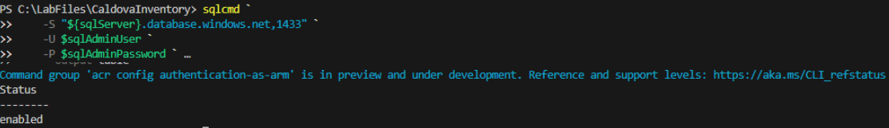
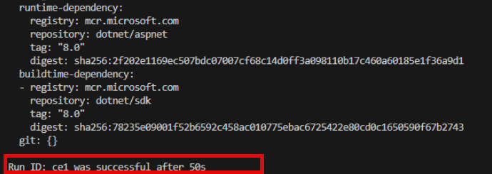
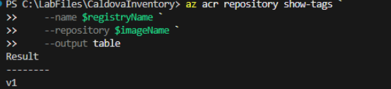
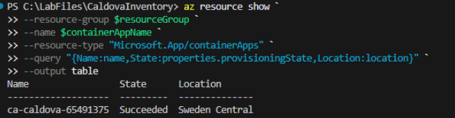
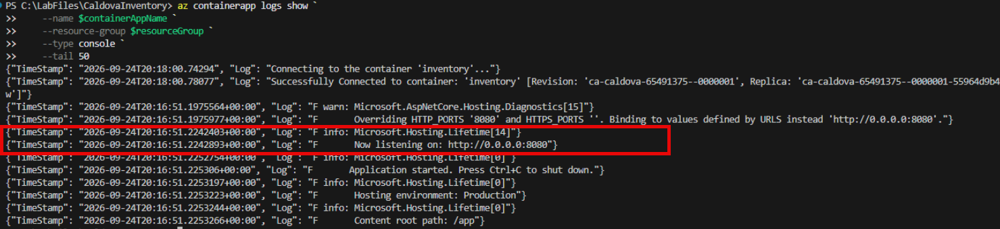

# Exercise 10: Build and deploy the application to Azure

Build and upload the application image to the predeployed Azure Container Registry, use the existing Azure identity and Container Apps infrastructure, deploy the built image, and validate the application startup configuration.

> **Note:** Use the same PowerShell terminal that you used in Exercise 9. The steps in this exercise use variables that you defined there, such as `$resourceGroup`, `$registryName`, `$sqlServer`, `$sqlAdminUser`, and `$sqlAdminPassword`. If you opened a new terminal, rerun the steps in the **Sign in and define resources** and **Define the Azure SQL administrator credentials** sections of Exercise 9 first.

## Verify Azure Container Registry authentication configuration

1. Verify the registry's ARM audience authentication configuration.

    ```powershell
    az acr config authentication-as-arm show `
        --registry $registryName `
        --output table
    ```

1. Confirm the output **Status** is showing **Enabled**.

    

    > **Note:** If ARM audience authentication isn't enabled, enable it.
    >
    > ```powershell
    > az acr config authentication-as-arm update `
    >     --registry $registryName `
    >     --status enabled
    > ```

## Build and upload the application image

1. Build and upload the application image to the predeployed Azure Container Registry.

    ```powershell
    az acr build `
        --registry $registryName `
        --image "${imageName}:v1" `
        .
    ```

1. Confirm that the ACR build succeeds.

    

    > **Note:** This process can take a minute or two to complete.

1. Verify that the **v1** image tag exists.

    ```powershell
    az acr repository show-tags `
        --name $registryName `
        --repository $imageName `
        --output table
    ```

1. Confirm that the output includes **v1**.

    

## Verify managed identity access to the registry

1. Obtain the predeployed managed identity IDs.

    ```powershell
    $identityId = az identity show `
        --name $identityName `
        --resource-group $resourceGroup `
        --query id `
        --output tsv
    ```

    ```powershell
    $principalId = az identity show `
        --name $identityName `
        --resource-group $resourceGroup `
        --query principalId `
        --output tsv
    ```

1. Obtain the registry resource ID.

    ```powershell
    $registryId = az acr show `
        --name $registryName `
        --resource-group $resourceGroup `
        --query id `
        --output tsv
    ```

## Verify the predeployed Container Apps Environment

1. Verify the Container Apps Environment provisioning state.

    ```powershell
    az resource show `
    --resource-group $resourceGroup `
    --name $containerAppName `
    --resource-type "Microsoft.App/containerApps" `
    --query "{Name:name,State:properties.provisioningState,Location:location}" `
    --output table
    ```

1. Confirm that **State** is **Succeeded**.

    

## Configure the predeployed Container App

1. Build the Azure SQL connection string in memory.

    ```powershell
    $azureConnectionString = "Server=tcp:${sqlServer}.database.windows.net,1433;Initial Catalog=$databaseName;Persist Security Info=False;User ID=$sqlAdminUser;Password=$sqlAdminPassword;MultipleActiveResultSets=False;Encrypt=True;TrustServerCertificate=False;Connection Timeout=30;"
    ```

1. Update the existing Container App to use the uploaded image, the connection-string secret reference, and port **8080**.

    ```powershell
    az containerapp update `
        --name $containerAppName `
        --resource-group $resourceGroup `
        --image "${registryName}.azurecr.io/${imageName}:v1" `
        --set-env-vars "ConnectionStrings__Inventory=secretref:inventory-connection-string"
    ```

1. Configure external ingress to target port **8080**.

    ```powershell
    az containerapp ingress enable `
        --name $containerAppName `
        --resource-group $resourceGroup `
        --type external `
        --target-port 8080
    ```

1. Get the Container App FQDN and define the public URL.

    ```powershell
    $fqdn = az containerapp show `
        --name $containerAppName `
        --resource-group $resourceGroup `
        --query properties.configuration.ingress.fqdn `
        --output tsv

    $baseUrl = "https://$fqdn"
    ```

    ```powershell
    $baseUrl
    ```

1. Inspect the application startup logs.

    ```powershell
    az containerapp logs show `
        --name $containerAppName `
        --resource-group $resourceGroup `
        --type console `
        --tail 50
    ```

1. Confirm that the active revision is provisioned and that the application is listening on port **8080**.

    

---

[← Exercise 9: Migrate the data to Azure SQL Database](../09-migrate-the-data-to-azure-sql-database/index.md) · [Lab index](../../Index.md) · [Exercise 11: Validate the cloud workload →](../11-validate-the-cloud-workload/index.md)
