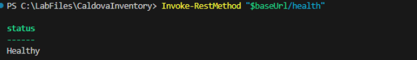
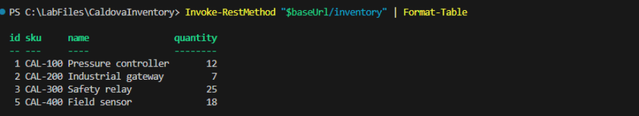
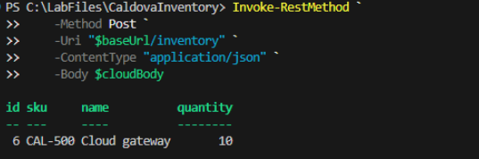
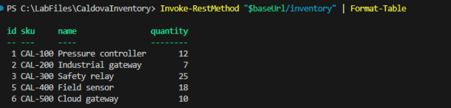

# Exercise 11: Validate the cloud workload

Validate the deployed application through its Azure Container Apps endpoint by testing health and inventory reads, creating CAL-500, and confirming that the cloud write persists in Azure SQL Database.

> **Note:** Use the same PowerShell terminal that you used in Exercises 9 and 10. The steps in this exercise use the `$baseUrl` variable from Exercise 10. If you opened a new terminal, rerun the steps in the **Sign in and define resources** section of Exercise 9 and the **Get the Container App FQDN and define the public URL** step in Exercise 10 first.

## Test the health and read paths

1. Test the health endpoint.

    ```powershell
    Invoke-RestMethod "$baseUrl/health"
    ```

1. Confirm that the response returns **Healthy**.

    

1. Test the inventory endpoint.

    ```powershell
    Invoke-RestMethod "$baseUrl/inventory" | Format-Table
    ```

1. Confirm that four rows are returned, including **CAL-400**.

    

## Test the cloud write path

1. Create the request body.

    ```powershell
    $cloudBody = @{
        sku = "CAL-500"
        name = "Cloud gateway"
        quantity = 10
    } | ConvertTo-Json
    ```

1. Submit the new inventory item.

    ```powershell
    Invoke-RestMethod `
        -Method Post `
        -Uri "$baseUrl/inventory" `
        -ContentType "application/json" `
        -Body $cloudBody
    ```

1. Confirm that the response includes **CAL-500** and an assigned numeric ID.

    

1. Verify that the write persisted.

    ```powershell
    Invoke-RestMethod "$baseUrl/inventory" | Format-Table
    ```

1. Confirm that the final inventory read returns **five** rows.

    

---

[← Exercise 10: Build and deploy the application to Azure](../10-build-and-deploy-the-application-to-azure/index.md) · [Lab index](../../Index.md) · [Exercise 12: Record migration evidence and complete the modernization brief →](../12-record-migration-evidence-and-complete-the-modernization-brief/index.md)
