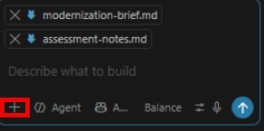
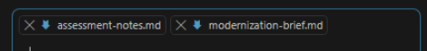

# Exercise 12: Record migration evidence and complete the modernization brief

Document the verified Azure migration and deployment results, then use GitHub Copilot Agent mode to complete the modernization brief from the recorded evidence and verify that the final deliverables contain only supported conclusions.

1. Open **evidence/assessment-notes.md**.

1. Record:

    - The predeployed resource group and discovered resource names.
    - The four-row BCP export and nonzero export-file length.
    - The four-row BCP import and reconciled Azure SQL row count.
    - The registry, repository, image tag, and build status.
    - The managed identity and verified **AcrPull** assignment.
    - The Container App, environment, revision, and public URL.
    - The secret-reference name without its value.
    - The cloud health, read, and write results.
    - Any deployment issue, relevant log evidence, and resolution.

## Example Azure migration evidence

| Check | Result | Evidence |
| --- | --- | --- |
| Local table migrated to Azure SQL Database | `Pass` | `BCP exported 4 rows from SQL01 and created InventoryItems.bcp with a nonzero file length. BCP imported 4 rows into the predeployed CaldovaInventory Azure SQL database, and the reconciled row count was 4.` |
| Container image built | `Pass` | `The caldova-inventory:v1 image was successfully built and uploaded to the predeployed Azure Container Registry, and the v1 tag was verified in the repository.` |
| Container app deployed | `Pass` | `The existing Azure Container App was updated to use the built caldova-inventory:v1 image. The application started successfully and was verified listening on port 8080.` |
| Connection string uses a secret reference | `Pass` | `The Container App uses ConnectionStrings__Inventory with the preconfigured inventory-connection-string secret reference.` |
| Cloud health endpoint responds | `Pass` | `GET /health returned Healthy from the Container App public URL.` |
| Cloud inventory read succeeds | `Pass` | `The initial cloud GET /inventory request returned 4 migrated inventory records, including CAL-400.` |
| Cloud inventory write succeeds | `Pass` | `POST /inventory created CAL-500 with an assigned ID, and the final GET /inventory request returned 5 records.` |
| Deployment issues | `None` | `No deployment issues found` |

1. Save **evidence/assessment-notes.md**.

## Complete the modernization brief

1. Open **evidence/modernization-brief.md**.

1. In Copilot Chat, select **Agent**.

1. Attach **evidence/assessment-notes.md** and **evidence/modernization-brief.md** by selecting the **+** in the chat window.

    

    

1. Enter:

    ```text
    Update the attached modernization-brief.md using only the verified information in
    assessment-notes.md.

    Do not reanalyze the workspace and do not perform additional research.

    Complete the existing sections of modernization-brief.md with:

    - The three prioritized modernization findings already documented.
    - The completed connection-string configuration change.
    - The successful application image build.
    - The migration of the four inventory records to Azure SQL Database.
    - Azure Container Apps and Azure SQL Database as the implemented lab targets.
    - The verified local and cloud validation results.
    - The security, reliability, and operations gaps supported by the evidence.
    - The migration sequence and validation gates.
    - A rollback direction based only on the documented implementation.
    - The demonstrated business value of the modernization work.
    - The next production-hardening actions supported by the evidence.

    The Azure infrastructure in the lab resource group was predeployed. Do not state that the learner
    created the Azure resources. The learner initialized Azure SQL Database, migrated
    the source data, built and uploaded the application image, updated the existing
    Container App, and validated the cloud workload.

    Do not invent performance results, cost savings, production readiness, customer
    requirements, or other unsupported facts.

    If information required by the existing template is not present in
    assessment-notes.md, write it as a discovery question.

    Edit only modernization-brief.md.
    ```

1. Review the generated brief against the application files and recorded evidence.

1. Select **Keep** to accept the Copilot agent's changes to **modernization-brief.md**.

1. Save **evidence/modernization-brief.md** and review the findings.

## Verify the required deliverables

1. Confirm that the brief includes the top three modernization blockers.

1. Confirm that the brief includes the completed configuration improvement.

1. Confirm that the brief includes local and cloud validation evidence.

1. Confirm that the brief identifies Azure Container Apps and Azure SQL Database as the implemented lab targets.

1. Confirm that the brief distinguishes the predeployed infrastructure from the performed migration and application deployment tasks.

1. Confirm that the brief includes security and operations gaps, rollback direction, business value, the next modernization wave, and discovery questions.

---

[← Exercise 11: Validate the cloud workload](../11-validate-the-cloud-workload/index.md) · [Lab index](../../Index.md) · [Clean up →](../../Cleanup.md)
